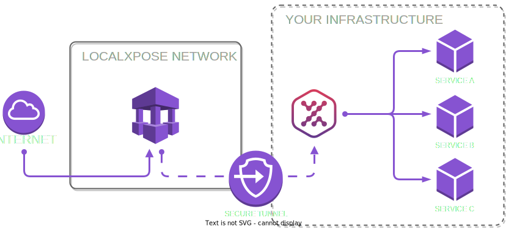

# LocalXpose GitHub Action

Create secure tunnels for webhooks, integration testing, and PR preview environments using [LocalXpose](https://localxpose.io).

[](https://github.com/marketplace/actions/localxpose-tunnel)
[](https://github.com/localxpose/localxpose-action/actions/workflows/ci.yml)
[](https://github.com/localxpose/localxpose-action/actions/workflows/codeql.yml)
[](https://opensource.org/licenses/MIT)

## Features

- 🚀 **Zero Configuration** - Start tunneling in seconds
- 🔒 **Secure** - End-to-end encryption with authentication
- 🌍 **Global Regions** - US, EU, and AP endpoints
- 💬 **PR Comments** - Automatic preview URLs in pull requests
- ⚡ **Fast & Reliable** - Production-ready tunnel infrastructure

## Quick Start

### Basic Usage

Expose a local port to the internet on an ephemeral url:

```yaml
- name: Start LocalXpose tunnel
  uses: localxpose/localxpose-action@v1
  id: tunnel
  with:
    port: 3000
    token: ${{ secrets.LX_ACCESS_TOKEN }}
    
- name: Use tunnel URL
  run: echo "Service available at ${{ steps.tunnel.outputs.url }}"
```

### PR Preview Environments

Automatically comment tunnel URLs on pull requests:

```yaml
name: PR Preview
on:
  pull_request:
    types: [opened, synchronize]

jobs:
  preview:
    runs-on: ubuntu-latest
    permissions:
      contents: read
      pull-requests: write
    steps:
      - uses: actions/checkout@v4
      
      - name: Start your app
        run: npm start &
        
      - name: Create preview tunnel
        uses: localxpose/localxpose-action@v1
        with:
          port: 3000
          token: ${{ secrets.LX_ACCESS_TOKEN }}
          pr-comment: true
```

## Configuration

### Inputs

| Input | Description | Required | Default |
|-------|-------------|----------|---------|
| `port` | Local port to expose | **Yes** | - |
| `token` | LocalXpose authentication token | No* | - |
| `type` | Tunnel type (`http`, `https`, `tcp`, `tls`)** | No | `http` |
| `region` | Tunnel region (`us`, `eu`, `ap`) | No | `us` |
| `subdomain` | Request specific subdomain (premium feature) | No | - |
| `pr-comment` | Post tunnel URL as PR comment | No | `false` |
| `pr-comment-name` | Display name for this tunnel in PR comment | No | - |
| `github-token` | GitHub token for PR comments | No | `${{ github.token }}` |

> *Token is required for free tier usage. Get yours from [the LocalXpose dashboard](https://localxpose.io/dashboard/access)
> **Free tier only supports `http` tunnels

### Outputs

| Output | Description |
|--------|-------------|
| `url` | Public tunnel URL |
| `hostname` | Tunnel hostname (without protocol) |
| `status` | Tunnel status (`running` or `failed`) |

## Examples

### Integration Testing with Webhooks

```yaml
- name: Start API server
  run: npm run start:api &
  
- name: Expose API for webhook testing
  id: api-tunnel
  uses: localxpose/localxpose-action@v1
  with:
    port: 8080
    token: ${{ secrets.LX_ACCESS_TOKEN }}
    
- name: Run webhook tests
  env:
    WEBHOOK_URL: ${{ steps.api-tunnel.outputs.url }}/webhook
  run: npm run test:webhooks
```

### Multiple Tunnels

Run multiple services with separate tunnels:

```yaml
- name: API tunnel
  id: api
  uses: localxpose/localxpose-action@v1
  with:
    port: 3000
    token: ${{ secrets.LX_ACCESS_TOKEN }}
    
- name: Frontend tunnel
  id: frontend
  uses: localxpose/localxpose-action@v1
  with:
    port: 8080
    token: ${{ secrets.LX_ACCESS_TOKEN }}
    
- name: Display URLs
  run: |
    echo "API: ${{ steps.api.outputs.url }}"
    echo "Frontend: ${{ steps.frontend.outputs.url }}"
```

#### With PR Comments

When running multiple instances, all tunnels are displayed in a single, organized PR comment:

```yaml
jobs:
  deploy:
    runs-on: ubuntu-latest
    permissions:
      contents: read
      pull-requests: write
    steps:
      # Frontend tunnel
      - name: Frontend tunnel
        uses: localxpose/localxpose-action@v1
        with:
          port: 3000
          pr-comment: true
          pr-comment-name: Frontend
          github-token: ${{ secrets.GITHUB_TOKEN }}
      
      # API tunnel
      - name: API tunnel
        uses: localxpose/localxpose-action@v1
        with:
          port: 8080
          pr-comment: true
          pr-comment-name: API
          github-token: ${{ secrets.GITHUB_TOKEN }}
```

This creates a single PR comment that shows all active tunnels, grouped by workflow run.

**PR Comment Features:**
- Single comment updated with all tunnels
- Shows tunnel status (active/expired)
- Groups tunnels by workflow run
- Automatically removes expired tunnels (>20 minutes)
- Shows remaining time for tunnels nearing expiry

### E2E Testing

```yaml
- name: Start application
  run: docker-compose up -d
  
- name: Create tunnel for E2E tests
  id: e2e-tunnel
  uses: localxpose/localxpose-action@v1
  with:
    port: 3000
    token: ${{ secrets.LX_ACCESS_TOKEN }}
    region: eu  # Select the region for improved latency
    
- name: Run E2E tests
  env:
    BASE_URL: ${{ steps.e2e-tunnel.outputs.url }}
  run: |
    # Note: Free tier tunnels expire after 15 minutes
    npm run test:e2e --timeout=10m
```

## Setup

### 1. Get LocalXpose Token

1. Sign up at [localxpose.io](https://localxpose.io/signup)
2. Copy your access token from the [dashboard](https://localxpose.io/dashboard/access)

> **Note: Free Tier Limitations**
> - Only HTTP tunnels are supported (no HTTPS/TCP/TLS)
> - Tunnels automatically close after 15 minutes
> - First-time visitors see a warning page before accessing your content
3. Add it to your repository secrets as `LX_ACCESS_TOKEN`

### 2. Add to Repository Secrets

```bash
# In your repository settings
Settings → Secrets and variables → Actions → New repository secret
Name: LX_ACCESS_TOKEN
Value: <your-token>
```

### 3. Use in Workflows

The action will automatically use the `LX_ACCESS_TOKEN` environment variable if no token input is provided.

## How LocalXpose Works

LocalXpose creates secure tunnels from your local services to public URLs, perfect for:

- **Webhook Development** - Test webhooks from services like Stripe, GitHub, or Slack
- **Mobile App Testing** - Access local backends from mobile devices
- **Client Demos** - Share work-in-progress without deployment
- **Integration Testing** - Test with real external services

<div align="center">
  
</div>

### Key Features

- **End-to-end encryption** - Your data is secure in transit
- **Custom subdomains** - Consistent URLs for your services
- **Request inspection** - Debug webhooks with full request details
- **No vendor lock-in** - Simple migration from other tunnel services

## Platform Support

| Platform | Status | Notes |
|----------|--------|-------|
| Ubuntu | ✅ Supported | Full functionality |
| macOS | 🚧 Coming Soon | Use manual installation |
| Windows | 🚧 Coming Soon | Use manual installation |

## Troubleshooting

### Common Issues

**Authentication Failed**
```yaml
# Ensure token is set correctly
- uses: localxpose/localxpose-action@v1
  with:
    port: 3000
    token: ${{ secrets.LX_ACCESS_TOKEN }}  # Check secret name
```

**Port Already in Use**
```yaml
# Make sure your service is running on the specified port
- run: npm start &  # Start your service first
- uses: localxpose/localxpose-action@v1
  with:
    port: 3000  # Must match your service port
```

**PR Comments Not Appearing**
```yaml
# Add required permissions
permissions:
  contents: read
  pull-requests: write  # Required for PR comments
```

**Warning Page on First Visit (Free Tier)**
- Free tier tunnels show a warning page to first-time visitors
- Users must click through to access your content
- Consider this when writing automated tests

**Tunnel Expires After 15 Minutes (Free Tier)**
```yaml
# Plan your workflows to complete within 15 minutes
- uses: localxpose/localxpose-action@v1
  with:
    port: 3000
    token: ${{ secrets.LX_ACCESS_TOKEN }}
    
# Run time-sensitive tasks immediately
- name: Quick tests
  run: npm run test:integration
  timeout-minutes: 10  # Leave buffer before expiry
```

**Only HTTP Tunnels on Free Tier**
```yaml
# Free tier limitation - these won't work:
type: https  # ❌ Premium only
type: tcp    # ❌ Premium only  
type: tls    # ❌ Premium only
type: http   # ✅ Free tier supported
```

## Advanced Usage

### Custom Tunnel Configuration

For advanced scenarios, you can use LocalXpose configuration files:

```yaml
- name: Create config
  run: |
    cat > loclx.yml << EOF
    tunnels:
      api:
        proto: http
        addr: 3000
        subdomain: my-api
      metrics:
        proto: tcp
        addr: 9090
    EOF
    
- name: Run with config
  run: loclx start --config loclx.yml
```

## Contributing

We welcome contributions! Please see our [Contributing Guide](CONTRIBUTING.md) for details.

## License

This project is licensed under the MIT License - see the [LICENSE](LICENSE) file for details.

---

<div align="center">
  <h3>Ready to get started?</h3>
  <p>
    <a href="https://localxpose.io/signup">
      
    </a>
  </p>
  <p>
    <a href="https://localxpose.io/download">Download LocalXpose</a> •
    <a href="https://localxpose.io/docs">Documentation</a> •
    <a href="https://localxpose.io/pricing">Pricing</a>
  </p>
</div>